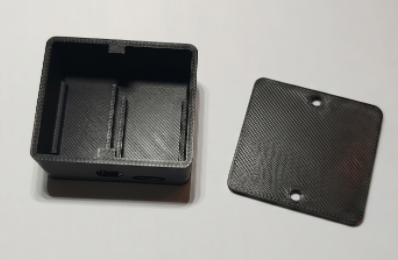

# Enclosure — Magic Button (ESP32-C6 Super Mini + mini PSU)

[](README.md)[](README.en.md)

Compact case for the **Magic Button** module (ESP32-C6 Super Mini + Hilink mini PSU).



> Model **V16.3** — boards side by side, snap-fit rails, Ø8 hole centered in the gap, and USB-C opening for ESP32 deploy/debug via JTAG.

## Files

| File | Purpose |
|------|---------|
| `base.stl` | Case base (print) |
| `tampa.stl` | Lid (print) |
| `case-matter-switch.png` | Photo of printed case (base + lid) |

## External dimensions

| Axis | mm |
|------|-----|
| Width (X, PSU \|\| ESP) | **45.0** |
| Depth (Y, long axes of boards) | **38.3** |
| Assembled height | **24.5** (base 22.5 + lid 2.0) |

**2 mm** walls; rounded outer corners (**r = 3 mm**).

## Components

| Module | Dimensions (mm) | Orientation |
|--------|-----------------|-------------|
| PSU | 20 × 34 × (15 + 5) (width × depth × height (PSU + pins)) | Flat |
| ESP32-C6 | 18 × 25 × 20 (width × depth × height) | Upright |

Fit clearance: **0.3 mm**.

## Internal layout

Top view (lid removed):

```
  Y=38 (rear)
  +--------+----+--------+
  |        |boss|        |
  |  PSU   | 2mm|  ESP   |
  | rail   |gap | rail   |
  |  18 mm |    |  21 mm |
  |        |boss|        |
  +--------+-Ø8-+--USB-C-+
  Y=0 (front)
```

- **PSU (left):** side rails with **15 mm** internal clearance; snap-fit guide to the bottom (guide height **4 mm**).
- **ESP (right):** rails with **18 mm** internal clearance; full board depth (**25.3 mm** with clearance).
- **Center gap:** **2 mm** between rails (pins / headers).
- **Rails:** **1.5 mm** tabs on each side; the board slides between them until seated on the bottom.

## Front face openings (Y = 0)

| Opening | Specification |
|---------|---------------|
| USB-C | Stadium profile **10.0 × 4.5 mm** (horizontal), aligned with ESP |
| Wires | **Ø 8 mm**, centered in the gap (X = gap center), just below the front boss |

## Fasteners

Lid with 2 **M2 × 6 mm** screws, centered on width (gap axis):

- Bosses on **front** and **rear** walls (height **7.5 mm**).
- Blind pilot **Ø 2.0 mm**, depth **6 mm** in the base.
- Through hole **Ø 2.4 mm** in the lid, with counterbore (**Ø 4.2 mm**).

## Suggested print settings

- PLA or PETG, **0.2 mm** layer, **2–3 perimeters**, 15–20% infill
- No supports: base with bottom on the bed; flat lid on the bed
- Test rail fit and USB-C clearance before closing the case
